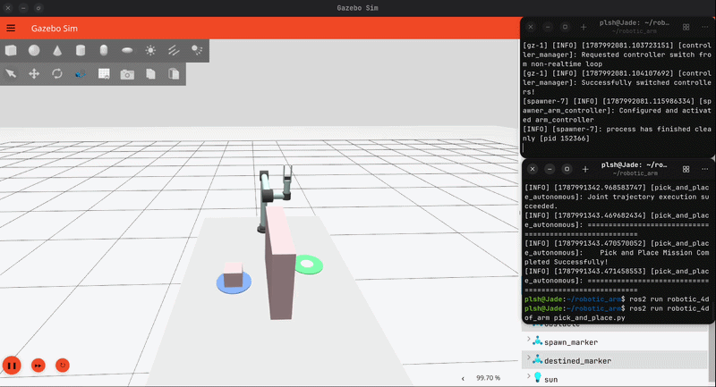
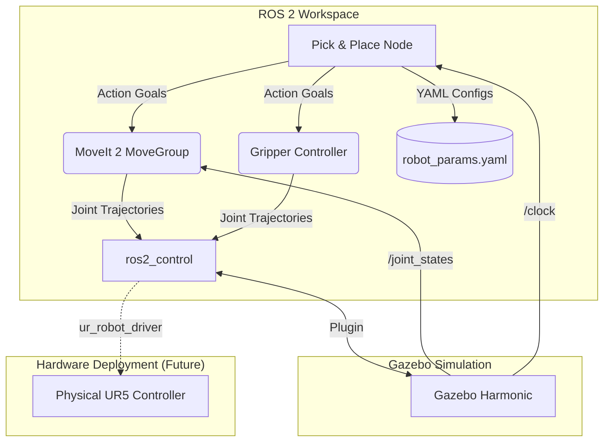

# Robotic 6-DOF Arm (UR5 Replica)


## Summary
This workspace contains a custom 6-Degree-of-Freedom (DOF) robotic arm, structurally inspired by the industrial UR5 robot. 

This project serves as a **production-grade testbed** for experimenting with pick-and-place tasks, obstacle avoidance, and robotic manipulation using ROS 2, MoveIt 2, and Gazebo. It features a fully dockerized environment, dynamic YAML parameterization, robust error handling, and automated CI/CD testing.

## Demo Video and GIF


---

## 🏗️ System Architecture



## 🚀 Quick Start (Docker - Recommended)

The easiest way to run the simulation is using our pre-configured Docker environment. No local ROS installation required.

1. **Build the Environment:**
   ```bash
   make docker-build
   ```
2. **Launch the Simulation:**
   ```bash
   make docker-sim
   ```
   *(Gazebo and MoveIt will launch. Wait for the arm and table to spawn).*

3. **Run the Autonomous Routine:**
   Open a second terminal and run:
   ```bash
   make docker-run
   ```

## 💻 Quick Start (Local)

If you have ROS 2 installed locally:

1. **Build the workspace:**
   ```bash
   make build
   ```
2. **Launch the Simulation:**
   ```bash
   make sim
   ```
3. **Run the Autonomous Routine:**
   Open a second terminal and run:
   ```bash
   make run
   ```

---

## 🛠️ Key Features
- **Production-Ready Docker Environment**: Launch the entire simulation stack instantly with zero ROS installation required, eliminating "works on my machine" bugs.
- **Robust Error Handling**: Real-time preflight checks, workspace bounds validation, and emergency abort routines ensure safe operation.
- **Dynamic Parameterization**: A single source of truth (`robot_params.yaml`) governs Cartesian coordinates, joint limits, velocities, and dimensions for rapid iteration without code changes.
- **Automated Testing & CI/CD**: A comprehensive `pytest` suite runs automatically on GitHub Actions on every push to guarantee motion reliability.
- **KDL Inverse Kinematics**: Customized IK solver configured specifically for this 6-DOF architecture.

## 📦 Packages and Architecture

| Directory / Package | Description |
| :--- | :--- |
| `robotic_4dof_arm` | The core ROS 2 package containing URDF/Xacro models, Python control scripts, and the `pytest` suite. |
| `arm_moveit_config` | MoveIt 2 configuration, including SRDF, kinematics settings, and the master `robot_params.yaml`. |
| `Dockerfile` | Builds an isolated Ubuntu environment with all required dependencies and control libraries. |
| `docker-compose.yml` | Maps display sockets and bridges isolated networks for seamless Gazebo UI rendering. |

## 🧪 Testing

To run the automated test suite locally:
```bash
make test
```
The suite verifies parameter consistency, planning scene integrity, and environment dimensions.

---

## ⚙️ Tested Environment Matrix

This repository is tested and supported on the following stack:

| Component | Version |
|---|---|
| **OS** | Ubuntu 24.04 (Noble Numbat) / Docker |
| **ROS 2** | Lyrical (or Jazzy) |
| **Gazebo** | Harmonic |
| **Python** | 3.12+ |

---

## 🔧 Hardware Deployment (Real UR5)

This repository has been designed with an abstraction layer to support a physical Universal Robots UR5 manipulator. 

A hardware bring-up stub is provided in `ur5_real.launch.py`. To deploy to physical hardware:
1. Ensure the UR5 controller is connected via Ethernet and the IP is pingable.
2. Install the ROS 2 UR driver: `sudo apt install ros-lyrical-ur`
3. Uncomment the driver block in `ur5_real.launch.py` and supply the correct IP.
4. Run: `ros2 launch arm_moveit_config ur5_real.launch.py`

*(Note: Ensure emergency stops are armed and velocity scaling is reduced before executing trajectories on hardware).*
